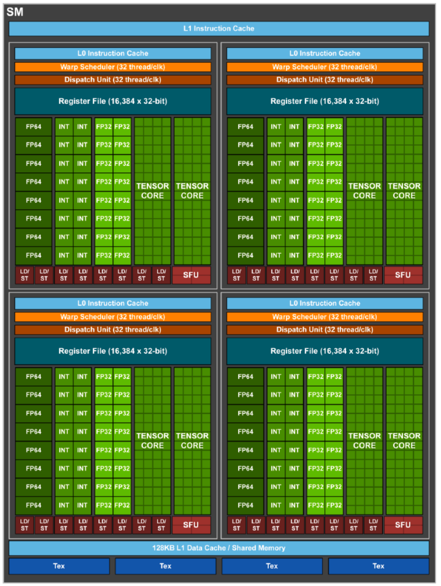

-------------------------------------
ABOUT WGPU/WINIT
-------------------------------------
1. Create window + surface
    - wgpu::Surface represents the renderable area of the window.Think of it as the "GPU-backed canvas" for your window.

2. Get adapter, device, queue
    - Adapters can be used to open a connection to the corresponding Device on the host system by using Adapter::request_device.
    - Device = handle to the physical or virtual GPU. Open connection to a graphics and/or compute device. Responsible for the creation of most rendering and compute resources.
    - Queue = used to submit commands to the GPU. Handle to a command queue on a device. A Queue executes recorded CommandBuffer objects and provides convenience methods for writing to buffers and textures. It can be created along with a Device by calling Adapter::request_device.

3. Configure surface

4. Get surface frame
    - Each frame, you get a texture 

5. Begin encoder → render pass → draw
    - The encoder builds a command buffer that we can then send to the GPU.
    - Render Pass: This is where drawing; You tell it: clear the screen, draw triangles, etc.
    
6. Finish encoder
7. Submit to queue
8. Present frame

************************************************************************************************
-------------------------------------
ABOUT GPUs
-------------------------------------

GPUs consists of cores that is a term used very loosely when referring to GPUs because they are high specialized. GPU "cores" are way simplier in their architecture and how they execute instructions. CPUs have branch prediction and speculative execution and other features, but GPU "cores" do not. So in reference to Nvidia Archetecture below is a basic breakdown:

GPU
├── Multiple SMs (Streaming Multiprocessors)
│   ├── Multiple CUDA cores
│   ├── Tensor cores (optional, newer GPUs) - these are specialized for matrix operations 
│   ├── Load/store units
│   ├── Shared memory and registers
│   └── Warp scheduler
            -> Warps in CUDA - A warp is a group of 32 threads within a thread block that executes the same instruction simultaneously. These threads are scheduled in batches by a warp scheduler to execute on an SM. The size of a thread block is set by an application. However, it should be a multiple of 32 due to the warp scheduling. A common choice of a thread block size is 256.
            Note: In concept, executing a warp (32 threads) on multiple cores of an SM is similar to executing vector instructions (using xmm/ymm/zmm registers on 4/8/16 data elements in a vector) on a CPU core.

Below is from NASA (https://www.nas.nasa.gov/hecc/support/kb/basics-on-nvidia-gpu-hardware-architecture_704.html)

Streaming Multiprocessors

A Streaming Multiprocessor is an individual processing unit in a GPU. The SMs are responsible for executing threads in parallel. Each SM includes:

    - Many single precision (FP32) CUDA cores
    - Many double precision (FP64) CUDA cores
    - Sometimes Tensor cores capable of mixed precision operations.
  
     - Many 32-bit (4 bytes) registers - The large number of registers enable a GPU to run a very large number of threads.
            -> A thread is a stream of instructions and data assigned to one single CUDA core. It is extremely lightweight with very little overhead. A thread block, also known as a cooperative thread array, is a group of threads that can cooperate with one another by synchronizing their execution and efficiently sharing data through a low latency shared memory. In CUDA, threads are organized into thread blocks. Many thread blocks are organized into a grid. Each thread block is executed by one SM and it cannot be migrated to other SMs. A SM executes single instruction multiple threads (SIMT) instructions in a thread block in parallel. Multiple SMs may work together on executing many thread blocks. SO it will take one instruciton and dispatch it to multiple threads. 

            GPU (device)
                ├── Grid (your kernel call)
                │   ├── Blocks (blockIdx.x)
                │   │   ├── Threads (threadIdx.x)

                A thread on a GPU is the smallest unit of execution. It’s like a "mini-program" that performs computations on a single piece of data.

                In CUDA programming, you write kernel functions that run in thousands or millions of threads, all performing the same logic on different data.

                🧩 How threads run in hardware
                    Let’s walk through the pipeline:
                        You launch a kernel with a grid of thread blocks.
                        Each block is assigned to an SM (Streaming Multiprocessor).
                        Inside each block:
                            Threads are grouped into warps of 32 threads.
                            All threads in a warp execute in lockstep — they all run the same instruction at the same time (SIMT = Single Instruction, Multiple Threads).
                        Each thread is mapped to a CUDA core — temporarily.
                            One SM might have 128 CUDA cores.
                            It will time-slice between many warps to hide latency.
                        - A combined L1 data cache/Shared Memory shared among threads running on the cores:
        
Here is a diagram of a SM = 

Real Example: NVIDIA RTX 3080
    68 SMs
    128 CUDA cores per SM
    = 8,704 CUDA cores

************************************************************************************************
-------------------------------------
ABOUT SHADERS
-------------------------------------
🎨 What is a Shader?

First, at a high level:

A shader is a small program that runs on the GPU to compute some part of rendering or processing. Common types include:
Shader Type	What It Does
Vertex shader	Transforms 3D vertices to 2D screen space
Fragment shader (a.k.a. pixel shader)	Determines final pixel color (lighting, texture, etc.)
Compute shader	General-purpose computation on the GPU (not just graphics)

These shaders are typically written in languages like GLSL, HLSL, or SPIR-V, and compiled to run on the GPU.
🧩 So then, what is a Shader Unit?

In hardware terms, a shader unit is:

    A physical component inside the GPU designed to execute shader programs.

Specifically, shader units:

    Are not separate from CUDA cores in modern GPUs.

    Are actually implemented using the same ALUs (arithmetic units) as CUDA cores, tensor cores, etc.

    Are grouped inside Streaming Multiprocessors (SMs).

So a shader unit is often just a CUDA core executing shader instructions in a graphics pipeline context.

***SHADER CORE IS A MARKETING TERM